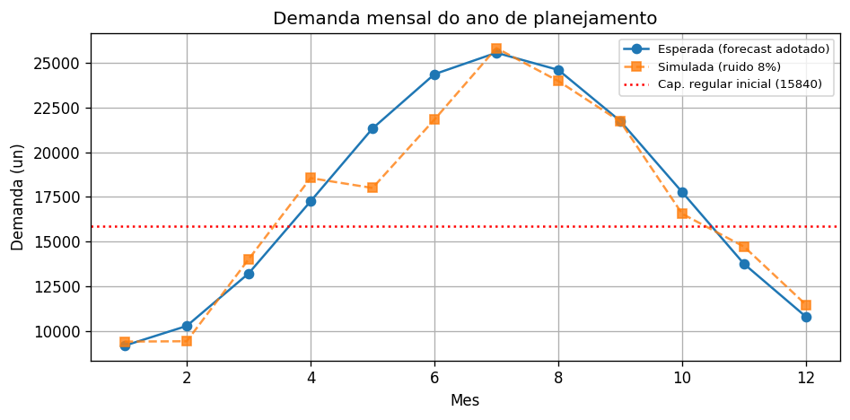
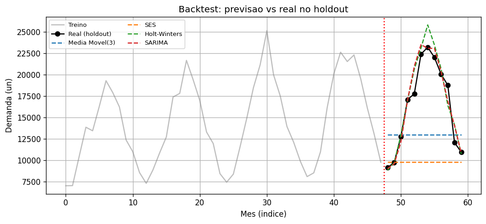
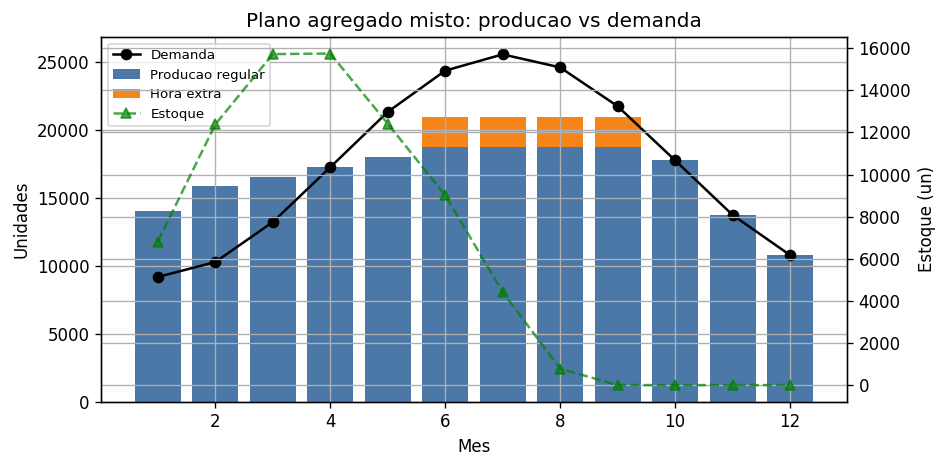
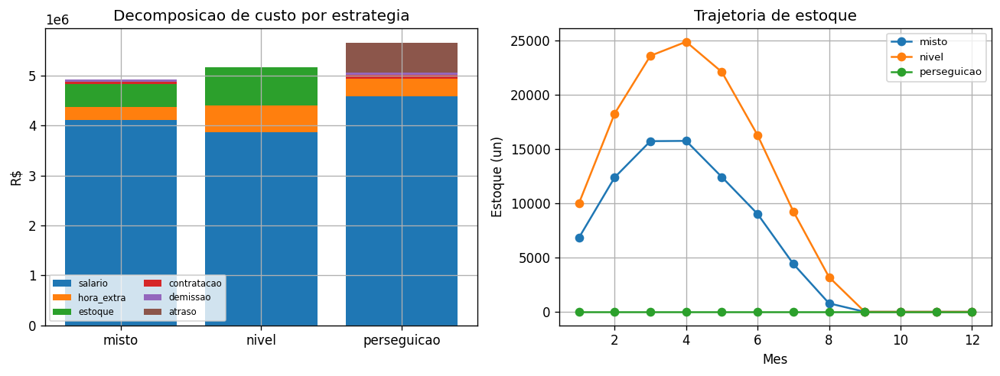
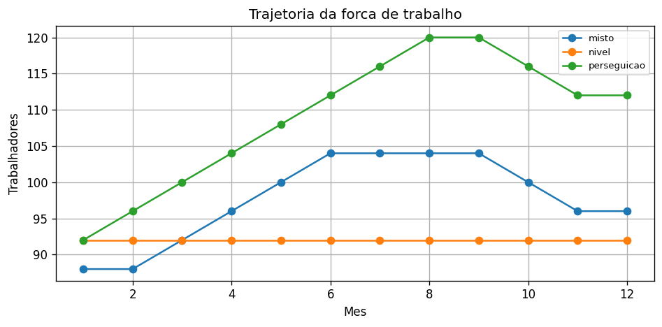
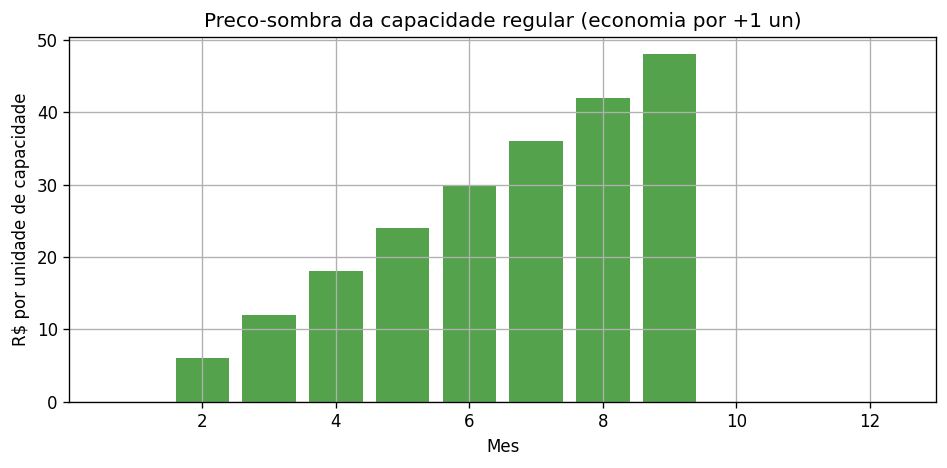
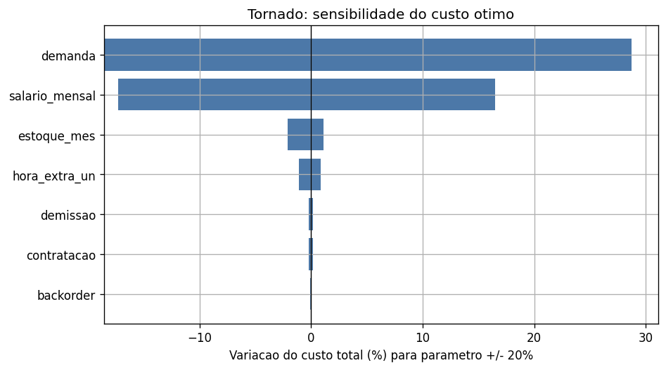
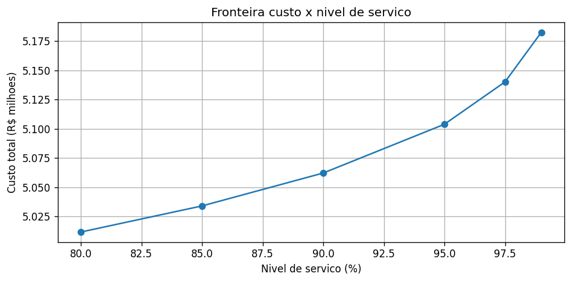
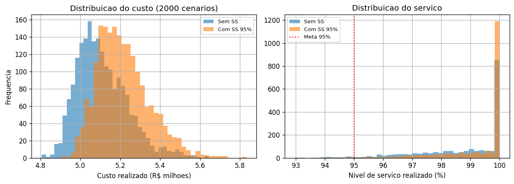

# Planejamento Agregado da Produção sob Demanda Sazonal e Incerta: uma Decisão Integrada de Produção, Força de Trabalho e Estoque

**Disciplina:** Planejamento e Controle da Produção (EPR/FT/UnB)
**Professor:** João Gabriel de Moraes Souza
**Autor:** _(preencher)_
**Repositório e notebook (código completo, não anexado a este PDF):** https://github.com/tiagondim-cpu/projeto-final-pcp

---

## 1. Resumo executivo

Neste projeto formulo e resolvo o problema de **planejamento agregado da produção** de um fabricante de ventiladores domésticos com demanda fortemente sazonal, decidindo, para um horizonte de 12 meses, **quanto produzir** (em tempo regular e em hora extra), **qual o tamanho da força de trabalho** (contratações e demissões) e **quanto manter em estoque** em cada mês, ao menor custo total, respeitando a capacidade e um nível de serviço-alvo.

O método integra três frentes da disciplina: (i) **previsão de demanda** com modelos de séries temporais, validada em backtest, que gera a demanda a planejar e a distribuição do erro; (ii) **programação linear** de custo-relevante, que produz o plano ótimo e permite comparar estratégias e extrair preços-sombra; e (iii) **gestão de estoque e nível de serviço**, em que o erro de previsão dimensiona o estoque de segurança e uma simulação de Monte Carlo mede a robustez do plano.

O principal resultado é que o **plano misto** (que combina antecipação em estoque, ajuste moderado da força de trabalho e hora extra no pico) custa **R\$ 4,92 milhões** e domina as duas estratégias puras: a de **nível** custa 5,2% a mais (excesso de estoque) e a de **perseguição** 15,2% a mais (contratações/demissões e atrasos no pico). A decisão recomendada é **adotar o plano misto com estoque de segurança calibrado para 95% de nível de serviço**, que eleva o serviço realizado sob incerteza e protege contra os cenários adversos a um acréscimo de custo de cerca de 2%.

---

## 2. Contexto e formulação do problema

### 2.1 Sistema produtivo

Considero uma fábrica brasileira de ventiladores domésticos de pequeno porte, cujo portfólio é agregado em um produto equivalente (uma prática usual em planejamento agregado, em que se planeja por família e não por SKU). A produção é *make-to-stock*: é possível produzir antecipadamente e estocar. A demanda tem forte sazonalidade de verão. Adoto um ano de planejamento que começa na baixa estação (mês 1), sobe até o pico no mês 7 e retorna à baixa ao final do horizonte.

### 2.2 O problema como decisão de PCP

O trabalho não descreve uma empresa: ele resolve uma **decisão**. Formalmente, para cada mês $t = 1,\dots,12$ preciso decidir simultaneamente:

- $P_t$: produção em tempo regular (un);
- $O_t$: produção em hora extra (un);
- $W_t$: número de trabalhadores;
- $H_t, F_t$: contratações e demissões;
- $I_t$: estoque ao fim do mês;
- $B_t$: demanda atendida com atraso (backorder).

O objetivo é minimizar o **custo total relevante** do plano, sujeito às restrições operacionais descritas na Seção 4.

### 2.3 Hipóteses

- Um único produto agregado; demanda mensal ao longo de 12 meses.
- Custos determinísticos e conhecidos; a incerteza está na demanda, tratada via erro de previsão.
- A produção regular é limitada pela força de trabalho ($P_t \le k\,W_t$, com $k = 180$ un/trabalhador/mês); a hora extra é limitada a uma fração da capacidade regular.
- O custo de material por unidade é aproximadamente constante (a produção anual é próxima da demanda anual) e, por isso, é excluído da função-objetivo, prática padrão em planejamento agregado. Os custos que efetivamente movem a decisão são salário, hora extra, estoque, contratação, demissão e atraso.

### 2.4 Restrições operacionais e indicadores

As restrições completas estão na Seção 4. Os **indicadores de desempenho** que acompanho são: custo total relevante, nível de serviço (fill rate), estoque médio e de pico, utilização da capacidade, rotatividade da força de trabalho (contratações + demissões) e volume de atrasos.

A Tabela 1 resume as premissas do caso.

**Tabela 1 - Premissas do caso**

| Grupo | Parâmetro | Valor |
|---|---|---|
| Demanda | Nível médio | 17.000 un/mês |
| | Amplitude sazonal | ±46% |
| | Mês de pico | 7 |
| | Tendência | +6% ao ano |
| | CV do erro de previsão | 8% |
| Capacidade | Produtividade | 180 un/trab/mês |
| | Trabalhadores iniciais | 88 |
| | Estoque inicial | 2.000 un |
| | Teto de hora extra | 12% da cap. regular |
| | Ajuste de mão de obra | ±4 trab/mês |
| Custos (BRL) | Salário | 3.500 /trab/mês |
| | Hora extra | 30 /un |
| | Estoque | 6 /un/mês |
| | Contratação | 2.500 /trab |
| | Demissão | 5.000 /trab |
| | Atraso | 50 /un/mês |
| Serviço | Nível-alvo | 95% (z = 1,645) |

A capacidade regular inicial é de 15.840 un/mês (17.741 un/mês com hora extra máxima). Como o pico de demanda chega a 25.565 un, **nem mesmo a capacidade com hora extra da força inicial atende o pico**: atravessá-lo exige antecipar produção em estoque na baixa estação e/ou ampliar a força de trabalho ao longo dos meses anteriores. Essa é a tensão central do problema.

---

## 3. Dados e preparação

Optei por **dados simulados**, escolha permitida pelo enunciado e adequada ao objetivo, que é analisar cenários controlados, variabilidade e políticas alternativas. A simulação me permite conhecer o processo gerador e, assim, avaliar de forma limpa o erro de previsão e a robustez das decisões.

A demanda esperada segue um sinal sazonal com tendência:

$$D(t) = 17000 \cdot \left(1 + 0{,}46\,\sin\!\left(\tfrac{2\pi (t-7)}{12} + \tfrac{\pi}{2}\right)\right)\cdot\left(1 + 0{,}06\,\tfrac{t-1}{12}\right).$$

A demanda observada acrescenta ruído multiplicativo $\varepsilon_t \sim \mathcal{N}(0,\,0{,}08^2)$. Para a etapa de previsão, gero 5 anos de histórico mensal consistentes com essa demanda e com a tendência anual, de modo que os modelos possam ser ajustados e validados antes de projetar o ano de planejamento. Toda a aleatoriedade usa uma semente fixa, garantindo reprodutibilidade (Seção 5). A Figura 1 mostra a demanda do ano de planejamento e a linha de capacidade regular inicial, evidenciando os sete meses em que a demanda supera a capacidade regular.

---

## 4. Modelagem quantitativa

### 4.1 Previsão de demanda

Comparo quatro modelos, alinhados ao ferramental da disciplina (`statsmodels`, `scikit-learn`): dois baselines sem sazonalidade — **média móvel** e **suavização exponencial simples (SES)** — e dois modelos sazonais — **Holt-Winters** (tendência aditiva, sazonalidade multiplicativa, período 12) e **SARIMA** $(1,1,1)\times(1,1,0)_{12}$. O ajuste é feito no histórico e a avaliação em um *holdout* de 12 meses (um ciclo sazonal completo), medindo MAE, RMSE e MAPE. O modelo escolhido é reajustado no histórico completo para projetar o ano de planejamento, e o erro do backtest fornece a distribuição usada no estoque de segurança e no Monte Carlo.

### 4.2 Planejamento agregado (programação linear)

A função-objetivo minimiza o custo total relevante:

$$\min \; Z = \sum_{t=1}^{12} \Big( c_W W_t + c_O O_t + c_I I_t + c_H H_t + c_F F_t + c_B B_t \Big),$$

com $c_W$ salário, $c_O$ hora extra, $c_I$ estoque, $c_H$ contratação, $c_F$ demissão e $c_B$ atraso. Sujeito a, para cada mês $t$:

$$
\begin{aligned}
& I_t - B_t = I_{t-1} - B_{t-1} + P_t + O_t - D_t && \text{(balanço de estoque)}\\
& W_t = W_{t-1} + H_t - F_t && \text{(balanço de força de trabalho)}\\
& P_t \le k\,W_t && \text{(capacidade regular)}\\
& O_t \le \theta\,k\,W_t && \text{(teto de hora extra)}\\
& H_t \le H^{\max}, \quad F_t \le F^{\max} && \text{(limites de ajuste)}\\
& B_{12} = 0 && \text{(atender toda a demanda)}\\
& P_t, O_t, W_t, H_t, F_t, I_t, B_t \ge 0.
\end{aligned}
$$

A produção regular não tem custo unitário adicional na função-objetivo porque o custo da mão de obra já está no salário $c_W W_t$, pago independentemente da produção. Essa é a escolha de modelagem que preserva o trade-off clássico do planejamento agregado: manter uma força de trabalho grande custa salário todo mês, o que dá valor a demiti-la na baixa estação.

### 4.3 Estratégias e análise de sensibilidade

As três estratégias canônicas são o mesmo PL com restrições adicionais: **nível** impõe força de trabalho constante ($W_t = W_1$); **perseguição** impõe estoque de antecipação nulo ($I_t = 0$); **mista** deixa todos os instrumentos livres. Para a fronteira custo × serviço, adiciono a restrição de estoque de segurança $I_t \ge z\cdot \mathrm{CV}_{\text{erro}}\cdot D_t$, variando $z$ conforme o nível de serviço.

---

## 5. Implementação computacional

O projeto é implementado em Python 3.13, com `numpy`/`pandas` (dados), `statsmodels` e `scikit-learn` (previsão), `PuLP` com o solver CBC (programação linear), `matplotlib` (gráficos) e `scipy` (distribuições). A organização separa responsabilidades: os parâmetros do caso ficam em um único módulo (`src/parametros.py`), o modelo de PL em `src/modelo.py` (fonte única, reutilizada pelo notebook e pelas verificações), e o notebook `notebooks/projeto_pcp.ipynb` conduz a análise ponta a ponta.

A **reprodutibilidade** é assegurada por: semente global única, dependências com versões fixadas (`requirements.txt`), dados gerados salvos em disco e notebook exportado em HTML. Antes de construir a análise, verifiquei que o caso é **não-trivial** por um script independente (`src/valida_premissas.py`): resolvendo os três planos como PLs, confirmei que o plano misto vence as estratégias puras e que a capacidade é efetivamente estressada pela sazonalidade — evitando o risco de calibrar um problema em que uma estratégia simples já fosse ótima. Em conformidade com o enunciado, o código não é colado neste PDF; está no repositório público e no notebook (que o GitHub renderiza com os resultados).

---

## 6. Resultados e análise de cenários

### 6.1 Previsão de demanda

A Tabela 2 e a Figura 2 mostram o desempenho no holdout. Os modelos sazonais dominam com folga: o **SARIMA** obtém MAPE de 5,4% e o Holt-Winters 6,4%, contra 28,9% da média móvel e 34,8% da SES. O resultado ilustra a lição de que baselines sem estrutura sazonal são inadequados para demanda sazonal. Escolho o SARIMA. O erro do modelo no holdout equivale a cerca de **8% da demanda média** — coerente com o ruído do processo gerador, o que valida o pipeline —, e é esse coeficiente de variação que dimensiona o estoque de segurança: no pico, o estoque de segurança para 95% de serviço é de aproximadamente 3.373 un.

**Tabela 2 - Erro de previsão no holdout (12 meses)**

| Modelo | MAE (un) | RMSE (un) | MAPE (%) |
|---|---|---|---|
| SARIMA | 888 | 1.310 | 5,4 |
| Holt-Winters | 1.119 | 1.526 | 6,4 |
| Média Móvel(3) | 5.058 | 5.978 | 28,9 |
| SES | 6.671 | 8.217 | 34,8 |

### 6.2 O plano agregado misto

A Figura 3 mostra o plano ótimo. A leitura operacional é nítida: nos meses de baixa (1 a 4) a fábrica **produz acima da demanda e acumula estoque** (que chega a ~15.700 un no mês 4); a força de trabalho **cresce gradualmente de 88 para 104** trabalhadores rumo ao pico; e a **hora extra é acionada apenas nos meses 6 a 9**, o núcleo da alta estação. Não há atrasos. Ou seja, o plano atravessa o pico com uma combinação de estoque antecipado, força de trabalho ampliada e hora extra pontual — exatamente o que a intuição de PCP recomenda, aqui quantificado.

### 6.3 Comparação de estratégias

A Tabela 3 e as Figuras 4 e 5 comparam as três estratégias. O custo do plano misto é **R\$ 4.915.334**. As estratégias puras são mais caras e falham por motivos distintos:

- A **estratégia de nível** (força de trabalho constante em 92 trabalhadores) evita a rotatividade de mão de obra, mas para atravessar o pico com produção mais estável precisa **acumular muito mais estoque** (pico de ~24.900 un) e recorrer a mais hora extra; custa **5,2% a mais** (R\$ 255 mil), sobretudo em estoque.
- A **estratégia de perseguição** (sem estoque de antecipação) zera o estoque ocioso, mas precisa **ajustar a força de trabalho intensamente** e, como os limites de ±4 trabalhadores/mês impedem acompanhar o salto sazonal, acaba **atrasando demanda no pico**; custa **15,2% a mais** (R\$ 746 mil), em contratações, demissões e atrasos.

**Tabela 3 - Custo por estratégia (R\$)**

| Estratégia | Custo total | Diferença vs misto |
|---|---|---|
| Misto | 4.915.334 | — |
| Nível | 5.170.426 | +5,2% |
| Perseguição | 5.661.200 | +15,2% |

### 6.4 Preços-sombra: onde a capacidade vale

Os preços-sombra da restrição de capacidade regular (Figura 6) revelam **onde e quanto vale ampliar a capacidade**. Fora da janela de aperto (meses 1 e 10 a 12), a capacidade é ociosa e não vale nada. Na aproximação do pico, o valor cresce de forma regular — cerca de **R\$ 6 por unidade a cada mês**, chegando a R\$ 48/un no mês 9. O incremento de R\$ 6 é exatamente o custo mensal de estoque: uma unidade de capacidade extra em um mês anterior permitiria antecipar produção e carregá-la até o pico, e o valor dessa antecipação é o custo de estoque evitado no caminho. Em termos gerenciais, isso diz que **ampliar capacidade só compensa nos meses pré-pico**, e que o valor de um trabalhador adicional (≈180 un de capacidade) nesses meses é substancial.

### 6.5 Sensibilidade dos parâmetros

O diagrama de tornado (Figura 7) mostra a variação do custo ótimo quando cada parâmetro é alterado em ±20%. O custo é mais sensível ao **nível de demanda** e ao **salário**, e comparativamente pouco sensível a custos de contratação/demissão e atraso — coerente com o fato de o plano misto usar esses instrumentos com parcimônia. Essa hierarquia orienta onde vale a pena investir em melhor informação (previsão de demanda) e negociação (custo de mão de obra).

### 6.6 Fronteira custo × nível de serviço

A Figura 8 e a Tabela 4 traçam o preço de cada ponto de serviço. Elevar o serviço exige mais estoque de segurança, dimensionado pelo erro de previsão medido na Seção 6.1. Sair de 80% para 95% custa cerca de +1,8 ponto percentual de custo; ir de 95% para 99% custa mais +1,6 p.p. O joelho da curva sugere que **95% é um alvo eficiente**: acima disso, o custo do serviço cresce mais rápido que o benefício.

**Tabela 4 - Fronteira custo × serviço**

| Nível de serviço | Custo total (R\$) | Acréscimo vs base |
|---|---|---|
| 80% | 5.011.742 | +2,0% |
| 90% | 5.062.164 | +3,0% |
| 95% | 5.103.825 | +3,8% |
| 99% | 5.182.438 | +5,4% |

### 6.7 Robustez sob incerteza (Monte Carlo)

Por fim, testo o plano comprometido contra a incerteza: fixo a produção do plano e simulo 2.000 realizações da demanda (previsão ± erro), medindo custo realizado e nível de serviço (Figura 9). O plano determinístico já é razoavelmente robusto, atingindo **serviço médio de 98,8%**, mas cumpre a meta de 95% em apenas 97% dos cenários. Adicionar o estoque de segurança de 95% eleva o serviço médio para 99,2% e, mais importante, **eleva para 99% a fração de cenários que cumprem a meta**, a um custo adicional de cerca de 2%. O valor do estoque de segurança está, portanto, na **proteção de cauda**: reduzir o risco de falhar a meta nos cenários adversos.

---

## 7. Tomada de decisão e trade-offs

**Recomendo adotar o plano misto com estoque de segurança calibrado para 95% de nível de serviço.** A justificativa é quantitativa e responde às perguntas centrais do problema:

- **Qual estratégia?** A mista domina as puras (nível +5,2%, perseguição +15,2%). A comparação não é óbvia a priori: exige o modelo para desempatar, e o modelo mostra que a resposta é combinar instrumentos, não usar um só.
- **Onde está o gargalo?** Na capacidade dos meses pré-pico; os preços-sombra quantificam seu valor e indicam que antecipar produção em estoque é mais barato do que depender de hora extra e contratações no pico — por isso o plano pré-constrói estoque.
- **Quanto custa o serviço?** A fronteira mostra que 95% é um alvo eficiente; subir a 99% custa mais 1,6 p.p. de custo.
- **O plano é robusto?** Sim; e o estoque de segurança compra proteção de cauda (cobertura da meta de 97% para 99% dos cenários) por ~2% de custo.

Os principais **trade-offs** avaliados são: custo total × nível de serviço (fronteira); estabilidade da força de trabalho × custo de estoque (nível vs perseguição); e flexibilidade de curto prazo × custo de antecipação (hora extra vs estoque).

**Riscos e limitações.** O modelo assume custos determinísticos e um único produto agregado; o lead time é implícito e fixo. Extensões naturais e de alto valor seriam: (i) lead time de fornecimento estocástico; (ii) desagregação do plano em um Programa Mestre de Produção (MPS) e MRP multiproduto; e (iii) uma formulação estocástica/robusta em dois estágios, em vez do plano determinístico com Monte Carlo *ex post*. Ainda assim, para a decisão agregada de 12 meses, a abordagem adotada é adequada e conservadora.

---

## 8. Conclusão

Transformei um problema de PCP em uma decisão fundamentada em evidência quantitativa. Partindo de uma previsão de demanda validada (SARIMA, MAPE 5,4%), formulei e resolvi o planejamento agregado por programação linear, comparei estratégias, extraí preços-sombra, tracei a fronteira custo × serviço e testei a robustez por simulação. O plano misto com estoque de segurança de 95% é a política recomendada: minimiza o custo total relevante (R\$ 4,92 milhões), domina as estratégias puras e mantém o nível de serviço sob incerteza a um custo marginal pequeno.

A principal implicação para o PCP é que o valor do planejamento agregado não está em nenhum instrumento isolado — estoque, força de trabalho ou hora extra —, mas em **coordená-los** ao longo do tempo em função da sazonalidade e da incerteza. Como possíveis extensões, destaco a integração com MPS/MRP, a modelagem de lead time estocástico e a otimização robusta, que aprofundariam a decisão sem alterar sua estrutura central.
